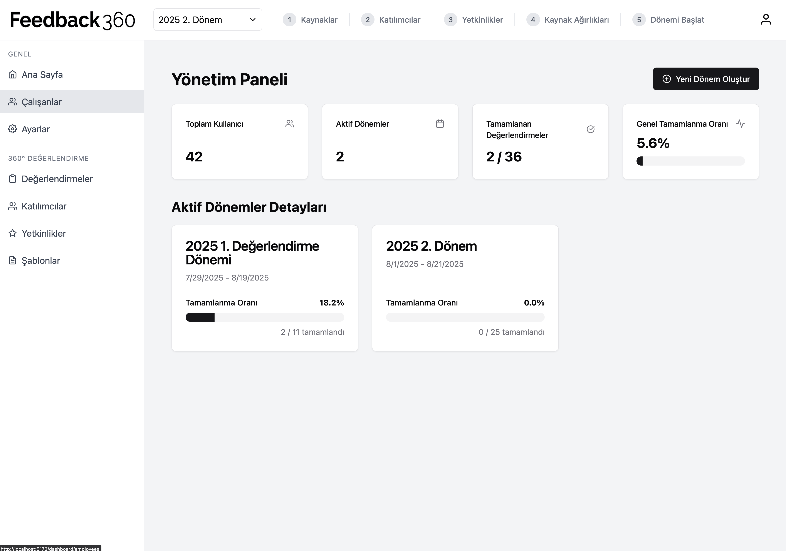

# Feedback 360: Streamline Your Performance Reviews

Feedback 360 is a powerful, web-based platform designed to facilitate comprehensive 360-degree performance evaluations within an organization. It empowers employees with constructive feedback from managers, peers, and subordinates, fostering a culture of continuous growth and development.



## Core Concepts

The system is built around a few key concepts:

*   **Evaluation Period:** A defined timeframe (e.g., "Q4 2024 Review") during which feedback is collected.
*   **Competencies:** Specific skills or behaviors to be evaluated (e.g., "Communication," "Teamwork").
*   **Questions:** Targeted questions that measure a specific competency.
*   **Participants:** The employees who are being evaluated.
*   **Evaluators:** The people providing feedback, assigned to participants with a specific relationship (Self, Manager, Peer, Subordinate).

## Key Features

### Administrative Dashboard

*   **Period Management:** Create, update, and manage the status of evaluation periods (Not Started, In Progress, Completed).
*   **Competency & Question Library:** Define a central library of competencies and associated questions.
*   **Participant & Evaluator Assignment:** Easily assign employees as participants and designate their respective evaluators for each period.
*   **Weight Configuration:** Assign different weights to competencies and evaluator types (e.g., a manager's feedback may count more).
*   **Comprehensive Reporting:** View detailed reports on individual and team performance once a period is complete.
*   **User Management:** Invite and manage admin and employee user accounts.

### Employee Portal

*   **Simple Interface:** A clean and intuitive dashboard for employees to see their pending evaluations.
*   **Feedback Submission:** Easily fill out and submit feedback forms for assigned colleagues.

## Admin Workflow: Running an Evaluation Cycle

1.  **Create an Evaluation Period:** Define the name and duration of the feedback cycle.
2.  **Define Competencies:** Add the core competencies you want to evaluate.
3.  **Add Questions:** Populate each competency with relevant questions.
4.  **Assign Participants:** Select the employees to be evaluated in this period.
5.  **Assign Evaluators:** For each participant, assign who will provide feedback (including themselves).
6.  **Set Weights:** Configure the importance of each competency and evaluator type.
7.  **Start the Period:** Move the period to "In Progress" to allow employees to submit feedback.
8.  **Monitor & Complete:** Track submission progress and close the period once finished.
9.  **Review Reports:** Analyze the generated feedback reports.

## Technical Overview

*   **Backend:** Java / Spring Boot
*   **Frontend:** React
*   **Database:** Requires a relational database like PostgreSQL or MySQL.

## Getting Started

### Prerequisites

*   Java JDK (17 or newer)
*   Node.js and npm
*   A running instance of PostgreSQL or MySQL

### How to Run

1.  **Configure Backend:**
    *   Navigate to the `backend` directory.
    *   Update the `src/main/resources/application.properties` file with your database connection details (URL, username, password).

2.  **Run Backend:**
    ```bash
    # From the 'backend' directory
    ./mvnw spring-boot:run
    ```

3.  **Run Frontend:**
    ```bash
    # From the 'frontend' directory
    npm install
    npm start
    ```

The application should now be running and accessible in your browser.
